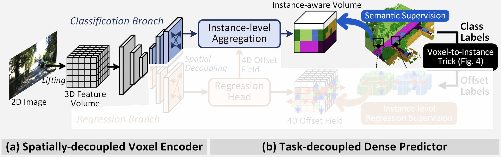
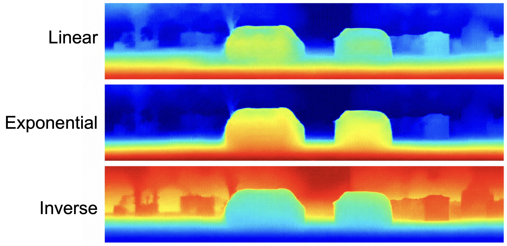
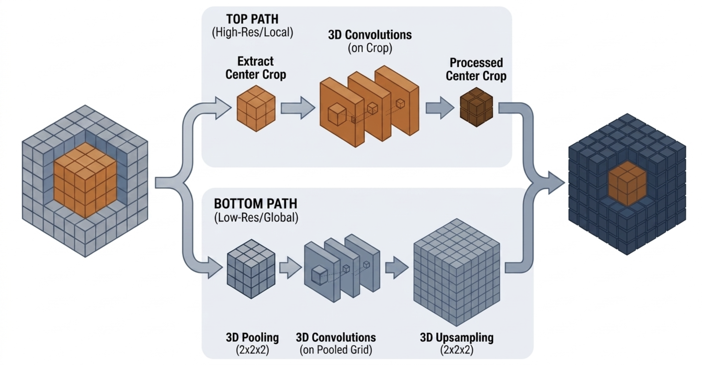
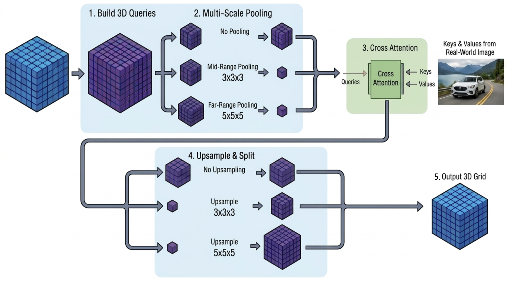
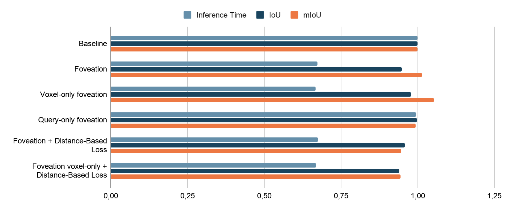

# Foveated Transformer for 3D Occuppancy Prediction

This repository contains the complete implementation and supporting modules for the course project titled **“Foveated Transformer for 3D Occuppancy Prediction”**, developed as part of the EPFL CS503 — Visual Intelligence: Machines and Minds course, in 2026.

Inspired by human foveated vision, the project explores whether the model can allocate more importance to critical regions of space and use lower resolution for the periphery in an attempt to gain efficency, while keeping prediction accurate.

## Inspired from VoxDet 

This repository is largely based on the official VoxDet model. See the original project and paper for full details:

- Project page: https://vita-epfl.github.io/VoxDet/
- ArXiv: https://arxiv.org/abs/2506.04623

This work keeps the original VoxDet architecture and training pipeline, and adds focused changes for efficiency: an adaptive loss module, and foveated tokenization (two variants). To see the changes made on top of the original model, refer to the commit history.

---

**Quick model summary**

VoxDet reformulates 3D semantic occupancy prediction as a dense object-detection-like task. Voxel features are aggregated into instance-centric tokens (VoxNT), the network predicts instance offsets and semantics, and outputs are pooled back to dense voxel occupancy. We preserve this core pipeline and extend it as described next.

**Foveated Transformer: main changes**

- **Simplified baseline**: the changes are implemented on a clean backbone, where the regression branch has been removed from the original sibling head, keeping a single classification + offset head. This simplifies training, reduces parameters, and makes the experiments easier to interpret.

  

- **Adaptive loss**: dynamic per-loss weighting that puts more weight on the voxels that are close to the camera and then decreases over the distance. Three versions are implemented: linear, exponential and inverse.  

  

- **Foveated tokenization**: two tokenization strategies to trade off computational cost vs. prediction quality:
  - **Voxel-only foveation**: the feature voxels go through a 2x2x2 pooling before processing and upsampling back to their original dimensions. In parallel, the center of the volume is processed at full resolution. Then, the center of the fully processed volume is removed to integrate the higher resolution center.
  
    
  - **Query-only foveation**: the feature volume then goes through cross attention. At this point, voxel queries are separated into three regions and the peripheral regions are pooled.


    

- **Results**: summary of the resulting inference time and predictive quality metrics (IoU, mIoU). The impact of the query reduction is negligible on inference time. However, when combined with voxel reduction, it provides worse performance than running the voxel reduction on its own. Thus the best efficiency gain comes from running voxel-only. Running foveation with a linear distance loss does not result in better performance.

  

---

# Project Structure

```
VoxDet/
├── assets/             # images
├── configs/            # all model configs (see specific files below)
├── docs/               # documentation
├── logs/               # saved results from the original VoxDet model
├── mmdet3d_plugin/     # optional extensions
├── packages/           # needed packages
├── scripts/            # job wrappers
├── tools/              # preprocessing and testing scripts
├── vggt/               # models
├── .gitignore
├── LICENSE
├── README.md
├── main.py             # train / eval / save predictions
├── misc                # utils to create directories / save settings
├── organize_ckpt.py    # helper to convert / organize pretrained checkpoints
└── requirements.txt
```

---

Key config files

- Baseline: `configs/baseline-dev-semantickitti-cam.py`
- Adaptive loss: `configs/baseline-dev-semantickitti-cam-distance.py`
- Foveation (both variants): `configs/foveated-backbone-dev-semantickitti-cam.py`
- Voxel-only foveation: `configs/ablation-voxel-only-dev-semantickitti-cam.py`
- Query-only foveation: `configs/ablation-query-only-dev-semantickitti-cam.py`
- Foveation and adaptive loss: `configs/foveated-backbone-dev-semantickitti-cam-distance.py`
- Voxel-only foveation and adaptive loss: `configs/ablation-voxel-only-dev-semantickitti-cam-distance.py`

---

# Setup & Installation

**Clone the repository:**
   ```bash
   git clone https://github.com/brygotti/VoxDet
   cd VoxDet
   ```

**Data download & preprocessing:** </br>
Follow `docs/dataset.md` for instructions regarding data download and preprocessing. If you are working on SLURM, you can use `scripts/preprocess_job.sh` to preprocess the dataset.

**Environment:** </br>
Follow `docs/install.md` for environment setup, CUDA and Python versions and dependency installation.

# How to Use ? 

## Training
Use the job wrapper `scripts/train_job.sh` to launch training (SLURM). It accepts a run spec (named mode or direct config path), a WandB key, a run name and number of GPUs. Example:
```bash
sbatch train_job.sh baseline <WANDB_KEY> voxdet-baseline 2
```

`scripts/train_job.sh` selects the correct config from the named modes: `baseline`, `distance`, `foveated`, `ablation-voxel-only`, `ablation-query-only`, `foveated-distance`, `voxel-only-distance`, or any `*.py` config path.

## Testing

- Use `scripts/benchmark_job.sh` to measure inference throughput and latency. 
- Use `scripts/eval_job.sh` to evaluate a checkpoint and optionally save predictions.
- Use `scripts/flops_tokens_job.sh` to compute FLOPS and token count for the foveation (both variants) model.

## Visualization

Once predictions are saved, generate visualization frames using `scripts/visualize_job.sh`:

```bash
sbatch visualize_job.sh /scratch/izar/gotti/semantic_kitti predictions_directory frames_directory
```

Convert frames to a video using `scripts/video_job.sh` (requires `ffmpeg`):

```bash
sbatch scripts/video_job.sh frames_directory output.mp4
```

---
# Acknowledgements

This fork builds on and extends the original VoxDet work. Please cite the original paper if you use this code: https://arxiv.org/abs/2506.04623

We are greateful for their work and thank them for their support: https://www.epfl.ch/labs/vita/.

---
